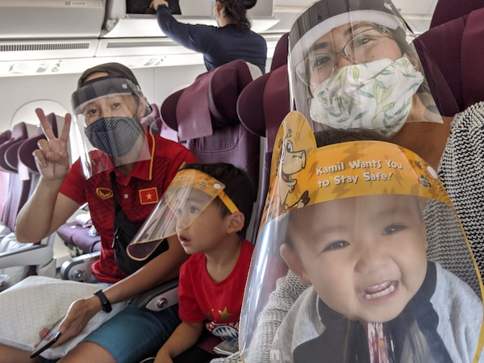

## Khởi nguồn cảm hứng

Thay đổi là một điều không thật sự dễ dàng. Thường sự thay đổi diễn ra do một biến cố hay tác động nào đó, chứ trong cuộc sống bình thường, khó khi nào chúng ta nghĩ đến chuyện thay đổi cuộc sống bình yên của mình, đặc biệt là đối với các gia đình có trẻ nhỏ. Quyết định đi theo lối sống tối giản của gia đình tôi cũng đến sau nhiều biến cố chủ quan và khách quan. Bài viết này kể lể sơ qua những tác động khiến vợ chồng tôi quyết định đi theo lối sống tối giản, bớt phụ thuộc vào vật chất và dành thời gian cho trải nghiệm của cả gia đình.

Gia đình tôi sống ở thành phố Munich, Đức được một thời gian khá dài, khoảng 15 năm. Hai vợ chồng có công ăn việc làm ổn định, 2 em bé đi học mẫu giáo rất vui và có nhiều bạn bè. Thành phố Munich là một trong thành phố những thành phố đáng sống nhất thế giới. Tóm lại là cuộc sống của gia đình tôi tương đối ổn định, không có gì phải phàn nàn.

Thế rồi khởi đầu vào một tuần tháng 3 năm 2019, thời tiết ở Đức khá rét, và đây cũng là mùa ốm cao điểm, bắt đầu bằng việc 2 bé nhà tôi bị ốm, chắc là do lây từ nhà trẻ. Chẳng bao lâu sau đến lượt 2 vợ chồng tôi cũng lăn ra ốm. Nói chung cả nhà ốm cứ người này lây người khác mãi không khỏi. Vốn là một người không ưa cái rét, và cũng rất ít khi ốm đau, việc bị ốm không làm được gì khiến cho tôi cảm thấy rất khó chịu. Hai vợ chồng nằm đắp chăn ôm nhau rên hừ hừ và bắt đầu có những suy nghĩ mông lung:

- Tôi sợ lạnh, và mùa đông ở nước Đức khá là lạnh, tôi và vợ muốn chuyển về một nơi nào đó ấm áp hơn.
- Vợ chồng tôi muốn các con có nhiều thời gian được về Việt Nam gặp gỡ người thân hơn.

Ngoài hai suy nghĩ chính ở trên, chúng tôi còn một số suy nghĩ khác nữa:

- Tôi và vợ đều là những người thích bay nhẩy tự do, không thích sự chây ì, dậm chân một chỗ, dễ khiến suy nghĩ bị ì ạch.
- Cuộc sống của chúng tôi ở nước ngoài khá ổn định, nhưng vẫn thiếu thốn đi sự gần gũi với gia đình người thân ở Việt Nam.
- Cả hai vợ chồng tôi đều thích đi du lịch, tìm hiểu văn hoá các nước, và đặc biệt là học tiếng nước ngoài.
- Chúng tôi đều nghĩ mình còn "trẻ", nên tận dụng cơ hội đi đây đi đó trải nghiệm, thay vì an phận cuộc sống trầm trầm tại Đức.

Rất nhiều cảm hứng thúc đẩy chúng tôi cần phải nhấc mông lên, đi trải nghiệm thế giới cùng các con được chúng tôi tìm thấy trên kênh Youtube **[The Bucket List Family](https://www.youtube.com/channel/UCuAHfJyWROB4XRReS43EWUw)**. Đây là kênh Youtube kể về một gia đình 2 vợ chồng cùng 2 con nhỏ bán hết nhà cửa ở Mỹ và đi du lịch vòng quanh thế giới suốt mấy năm liền. Qua các videos của kênh Youtube này, chúng tôi nhận thấy việc cho các con có những trải nghiệm du lịch ở các nước khác nhau, hoà mình vào cuộc sống ở nước đó thực sự đáng giá hơn rất nhiều so với nhưng món đồ chơi hay những bộ quần áo đẹp mà chúng tôi vẫn thường xuyên mua cho các con.

## Quyết định chuyển nhà

Sau rất nhiều đắn đo suy nghĩ, hai vợ chồng tôi đã quyết định sẽ rời nước Đức và chuyển đi chỗ khác. Đến đây câu hỏi chúng tôi đặt ra với chính bản thân là về luôn Việt Nam hay đi một nước nào khác. Sau rất nhiều tìm hiểu, tham khảo bạn bè, chúng tôi đã quyết định sẽ chuyển về Singapore. Singapore có nhiều lợi thế so với các lựa chọn khác vì mức sống khá ngang bằng các nước châu Âu và địa lý cũng rất gần Việt Nam. Hai điểm quan trọng khác nữa là đồ ăn ở Singapore nổi tiếng là ngon và thời tiết cũng ấm áp hơn ở Đức.

## Lối sống tối giản

Ngoài việc tôi bắt đầu tìm kiếm công việc ở Singapore, gia đình tôi cũng bắt đầu dọn dẹp nhà cửa giảm thiểu đồ đạc trong nhà để có thể chuyển đi bất cứ lúc nào. Từ đây chúng tôi mới thực sự hoảng sợ về số lượng đồ đạc trong nhà. Tôi bán và cho rất nhiều đồ đạc trong nhà rồi mà lần nào về nhà cũng vẫn thấy số lượng đồ đạc gần như không đổi.

Tình cờ cũng thời gian này, tôi được một anh bạn tặng cho quyển sách **"Goodbye, Things: On Minimalist Living"** (tựa đề tiếng Đức là **Das kann doch weg!: Das befreiende Gefühl, mit weniger zu leben. 55 Tipps für einen minimalistischen Lebensstil**). Tôi đọc quyển sách này và thực sự nghiệm ra là càng sở hữu nhiều đồ đạc, chúng ta sẽ càng mất thời gian để quản lý và sử dụng chúng. Mà thời gian là thứ quý giá hơn tất cả các loại đồ đạc. Đồ đạc mất đi chúng ta có thể đi mượn, đi thuê, đi mua lại được, nhưng thời gian mất đi thì chúng ta không có cách nào lấy lại được. 

Từ sau khi đọc quyển sách **"Goodbye, Things: On Minimalist Living"**, tôi càng ngày càng có hứng thú hơn với chủ đề **Minimalism**. Tôi có tìm hiểu thêm một số quyền sách khác về chủ đề sống tối giản, đặc biệt là đối với gia đình có trẻ nhỏ. Thông tin từ các quyển sách ngày càng đem đến cho tôi nhiều giác ngộ về lối sống mua sắm vô tội vạ mà gia đình tôi đang làm cũng như những lợi ích của lối sống tối giản có thể đêm lại cho cuộc sống gia đình. Và thế là hành trình tối giản hoá của chúng tôi bắt đầu. 

## Blog Gia Đình Tối Giản

Hành trình của chúng tôi cũng bắt đầu bằng việc mở blog **Gia Đình Tối Giản**. 

Blog này phục vụ 2 mục đích chính:

- Nó như một cuốn nhật ký cho cả gia đình tôi về hành trình tiến đến một cuộc sống tối giản.
- Chia sẻ kinh nghiệm của gia đình tôi cũng như lan truyền cảm hứng đến những ai cũng đang lưỡng lự muốn bắt đầu hành trình này.

Việc lưu trữ một cuốn nhật ký, đặc biệt là một cuốn nhật ký công khai có rất nhiều lợi ích. Nó như một minh chứng cho những dự định gia đình chúng tôi muốn làm, cũng như một chỗ để chúng tôi có thể nhìn lại, rút kinh nghiệm cũng như vực lại cảm hứng mỗi khi gặp khó khăn trên chặng đường gian nan này. Tôi sẽ có một bài viết về việc lưu trữ một cuốn nhật ký công khai trong một dịp sớm nhất.

---

(*) Bức ảnh trên tựa đề là khi cả gia đình tôi đang ngồi trên chuyến bay từ Munich sang Doha (Qatar) để chuyển tiếp sang Sing, đánh dấu một chặng đường mới của cả gia đình.